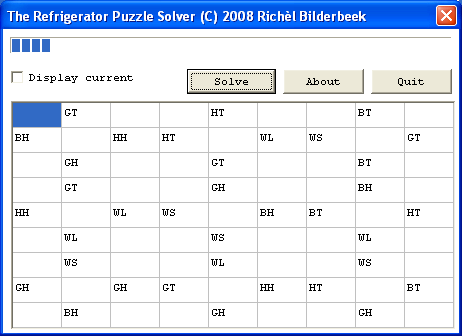
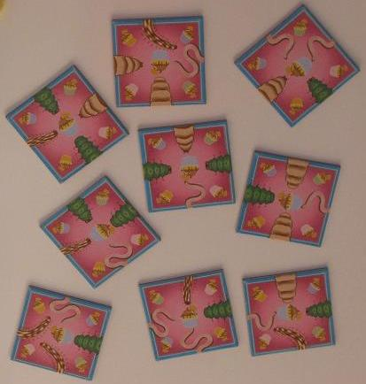

# Refrigerator Puzzle Solver
==================================================================================

> This type of puzzle is also called a monkey puzzle [1].

[Refrigerator Puzzle Solver](ToolRefrigeratorPuzzleSolver.htm) was
programmed to solve a puzzle on my refrigerator. I had a bet with my
girlfriend that I could find the solution quicker by writing a program,
than her trying by hand. I won (as one would expect, see \'Calcalute the
number of configurations to test\').

[Refrigerator Puzzle Solver](ToolRefrigeratorPuzzleSolver.htm) was
programmed at the 28th of December of 2008 in [C++](Cpp.htm) using the
IDE [C++
Builder](https://github.com/richelbilderbeek/cpp/blob/master/content/CppBuilder.md)
6.0. It uses the
[STL](https://github.com/richelbilderbeek/cpp/blob/master/content/CppStl.md),
[VCL](CppVcl.htm) and
[Boost](https://github.com/richelbilderbeek/cpp/blob/master/content/CppBoost.md)
[libraries](https://github.com/richelbilderbeek/cpp/blob/master/content/CppLibrary.md).

## Calculate the number of configurations to test
----------------------------------------------

The nine puzzle pieces can be put in 9\*8\*7\*6\*5\*4\*3\*2\*1 = 9! =
362880 sequences.

One puzzle piece has four orientations.

For a certain sequence of the nine pieces, there are 4\^9=262144
configurations.

Therefore, the number of possibilities to test equals 362880 \* 262144 =
95126814720.

Because there four solutions of the puzzle (due to rotation) one expects
to need to test 95126814720 / 4 = 23781703680 configurations. That is
more then 23 billion configurations!

How the program solves the puzzle
---------------------------------

The program starts with an ordering of the nine puzzle pieces.

First, one or more puzzle pieces are rotated in a systematic way, as
systematic as adding one to a four-digit number system.

Second, these (rotated) puzzle pieces are put in a recursive function.
This function takes a set of used and fitting puzzle pieces and a set of
unused puzzle pieces. It tries to put an unused puzzle piece in the next
place, trying all unused pieces. If successful, the function calls
itself with the (new) set of used puzzle pieces and the (new) set of
unused puzzle pieces. If the function fails, it returns an empty
solution.

Click on \'Display current\' in the program to see the computer do this.
Every try is shown for about 100 milliseconds, so one can actually see
what happens.

## References

1.  David Harel. Computers Ltd.: What They Really Can\'t Do. 2000.
    ISBN-10: 0198505558.
